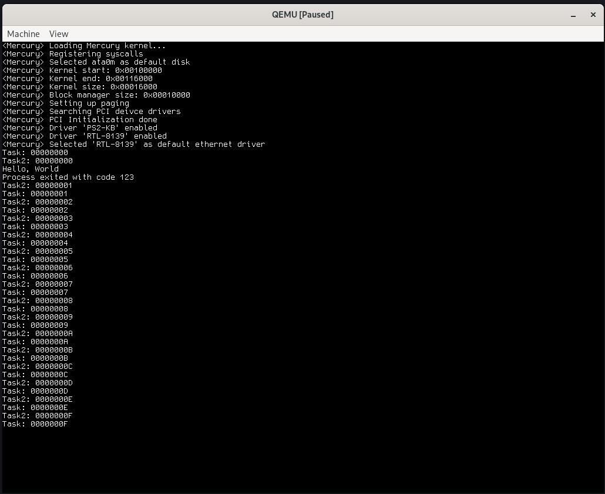
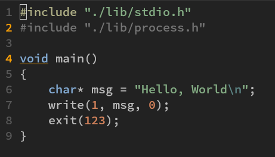

# Mercury

Mercury is a WIP x86-32 kernel. \
Report problems or give suggestions [here](https://github.com/rwy420/Mercury/issues) (Issue page) \
Tested & working on REAL hardware

### Building and booting
To build the kernel and create a bootable image including grub:
`sudo make grub`

To run the kernel using qemu:
`make qemu`
Or using bochs:
`make bochs`

### Features
- FAT16 driver
- ELF32 App / SO loader
- Multitasking

## Kernel Development Roadmap

### Process Isolation
- [X] Per-process page directories & address space separation
- [ ] User vs. kernel memory protection via page flags
- [ ] User stack and heap management (`brk()`-like syscall)
- [X] Switch `cr3` on context switch to isolate memory

### Linux-like Syscalls
- [ ] Syscall mechanism (e.g. `int 0x80`, `syscall/sysret`)
- [ ] Syscall table and dispatcher
- [ ] Basic syscalls: `read`, `write`, `open`, `close`, `exit`, `execve`
- [ ] User-space test program using syscalls

### C Standard Library
- [ ] Syscall wrappers (`write()`, `read()`, etc.)
- [ ] String/memory functions (`memcpy`, `strlen`, etc.)
- [ ] File I/O (`fopen`, `fread`, `fclose`)
- [ ] Static linking support (`libc.a`)

### FAT32 Filesystem
- [ ] Block device abstraction
- [ ] BPB and FAT table parsing
- [ ] File access (`open`, `read`, `close`)

### Driver Loading from Files
- [ ] Define driver format (e.g. ELF + metadata)
- [ ] Extend ELF loader for driver files
- [ ] Kernel driver registration API
- [ ] Load driver from FAT32 and call `init()`

### Init or Shell
- [ ] Launch shell or init from FAT32
- [ ] Load userland apps using `execve`

### On the way..
- [ ] Finish SATA driver
- [ ] Start with networking 
- [ ] Maybe switch to GRUB

**Screenshots** \
Multitasking and SO loading working: \
You can see two idle tasks counting up and a program using functions from LIBC.SO running

