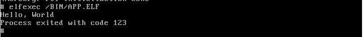

# Mercury

Mercury is a WIP x86-32 kernel. \
Report problems or give suggestions [Here](https://github.com/rwy420/Mercury/issues) (Issue page)

**Features**
- FAT16 driver
- ELF32 App / SO loader
- Multitasking

**Work in progress**
- Linux like syscalls
- AHCI driver
- Networking (Drivers and lwip)

 **Coming Features**
- Proper terminal
- Default system apps (ls, cat, echo...)
- Porting some apps made for Linux (Lua, Python...)

**Future ideas**
- Module system for drivers / services

**Screenshots** \
Dynamic library loading working: \
The APP.ELF file is using the LIBC.SO file 'make libc' and executed using the elfexec command

